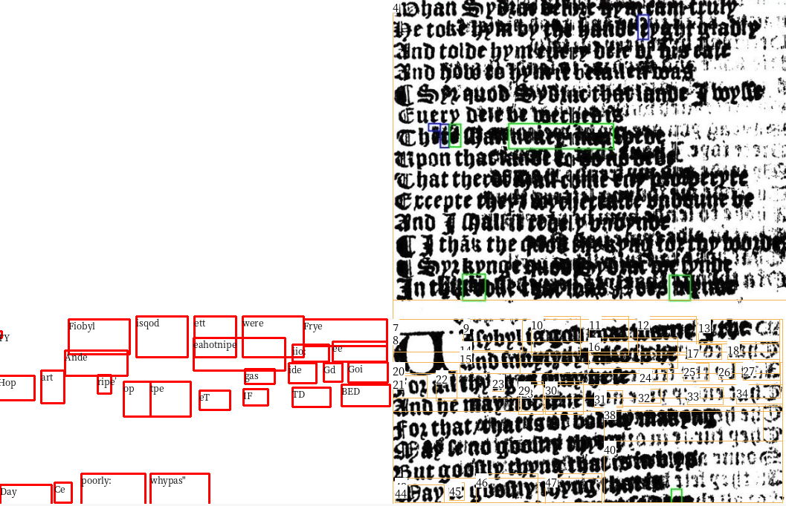
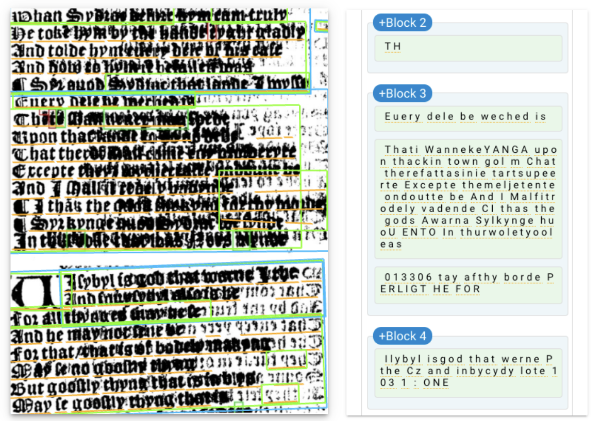
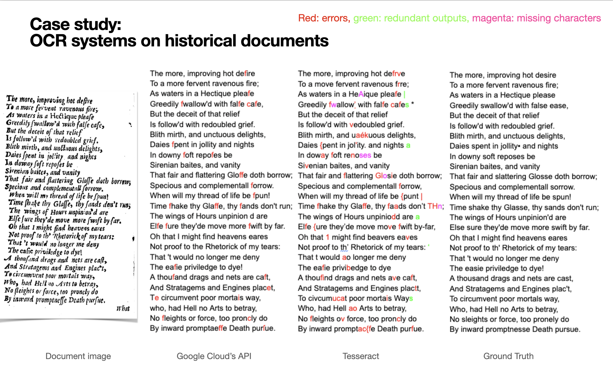

# icdar_rebuttal
## Response to R1

**More error analysis by document type:**
We agree that additional error analysis, broken down by properties of document type, would be useful. Fig. 6, in the current draft, provides some insight here: the image-only model seems to queue on formatting features like loosely spaced and varying line lengths. However, we entirely agree that quantitative analyses would be more valuable. As a preview: By breaking down the error analysis of the text-only BERT model by fraction of lines that contain poetry, we found that BERT achieves substantially lower accuracy on pages where fewer than 20% of the lines are poetry, misclassifying poetry-containing pages as non-poetry

|| F1|
|--|--|
|Full data| 67.24%|
<20% | 51.30%|

We will be sure to include additional analyses (e.g. F1 by language and layout) in future revisions.

**Analysis of multi-modal approach:**
Our main focus was comparing image-only with text-only models in order to demonstrate that image-only (without OCR) can work as well as text-based models for this type of classification task. While a multi-modal approach would still depend on OCR, we agree it would be interesting to evaluate this approach here. Because pretraining with multimodality is expensive on this dataset, we were unable to complete the full experiment during the rebuttal period. However, we can provide multi-modal linear probing results as a preview. We extract features from BERT and DiT and train a linear regression layer from scratch using the extracted features. For fair compasion, we also train a linreg on BERT only and DiT only. We observe modest performance gains from the multi-modal approach. In future revisions, we will add full joint multi-modal pretraining results, which may yield larger gains.

|| F1|
|--|--|
|BERT | 60.58%
|DiT| 58.34%
|BERT & DiT| 61.26%

**Appropriateness for ICDAR:**
Our poetry dataset is most useful for other research communities, including DH and NLP (we will add more related work in future revisions to demonstrate the utility of poetic corpora for NLP). However, the methodology we developed for its collection is directly relevant to the domain of ICDAR. By presenting this work at ICDAR, we’re showcasing an approach for data curation and sub-selection that avoids OCR entirely on noisy historical documents.
Moreover, SOTA models like DiT have achieved 92.69% on RVL-CDIP, but only achieve around 65% on EEBO-verse. This discrepancy highlights the difficulty of historical documents, which are often riddled with noise. Therefore, carefully labeled and cleaned large-scale annotated historical corpora are rare and valuable to ICDAR.

**STOA on historical printed OCR:**
Thank you for the question! We will update our appendix to provide a comparison of SOTA OCR performance. In [1], we can see that the latest version of Tesseract almost completely fails on blurry pages and has a high word error rate on relatively clean images. While Google Cloud API has fewer mistakes, it is not free and costly to scale to all of EEBO. Our paper's main contribution is to demonstrate that we can achieve similar performance on poetry detection without relying on OCR, potentially reducing the budget needed to curate large-scale datasets from raw historical corpora. For example, it takes Tesseract around 5s to OCR one historical page in EEBO, meaning that OCR-ing the full EEBO dataset would take more than 50 days on a 60-core CPU server.

## Response to R2

**Readability of images and tables:**
Thanks for your review! We suspect the issues you encountered may have been caused by PDF compression or easychair’s configuration. Our figures are all high resolution except Fig. 6, which intentionally uses a low resolution (224x244) to match the resolution used for our image-only model. We will address any font size differences you pointed out in future revisions.

## General response

We would like to thank reviewers for their constructive and valuable feedback! We created an anonymous repo (see [1]) on Github to display figures with improved readability.

**General comment about novelty and fit for ICDAR:**
Our main novelty is empirical: for large-scale dataset curation from large raw historical corpora, one can avoid OCR entirely even for semantic annotation (e.g. poetry vs prose) without loss of accuracy / quality in resulting data. This reduces costs and errors – cheap-enough OCR in this domain may be too errorful, while SOTA OCR on the entire corpus before sub-selection of poetry may be too expensive. This paradigm could be used in the future to create other resources from EEBO or other historical documents for downstream communities like DH. Will make this positioning clearer in future revisions.
